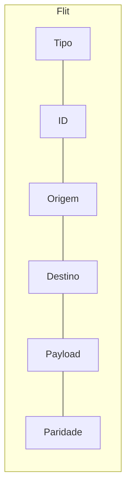
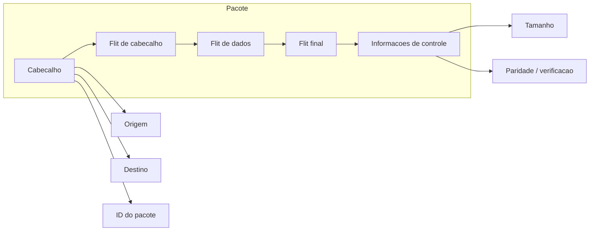
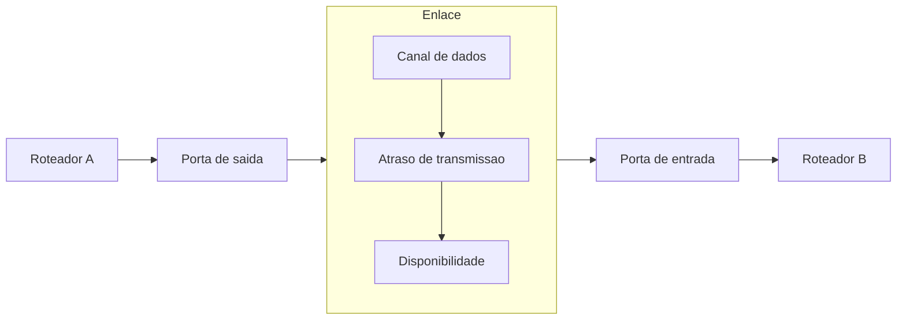
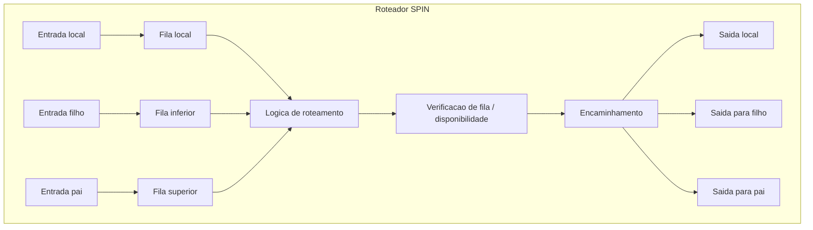

# Diagramas Mermaid

## Diagrama de Blocos da NoC

```mermaid
flowchart LR
    subgraph ORIGEM[No de origem]
        APP1[Modulo gerador] --> PKT[Pacote]
        PKT --> FLITS[Divisao em flits]
    end

    subgraph R1[Roteador 1]
        Q1[Fila de entrada]
        RT1[Logica de roteamento]
        Q1 --> RT1
    end

    subgraph R2[Roteador 2]
        Q2[Fila de entrada]
        RT2[Logica de roteamento]
        Q2 --> RT2
    end

    subgraph DESTINO[No de destino]
        RX[Recepcao dos flits] --> MSG[Mensagem recebida]
    end

    FLITS --> EN1[Enlace]
    EN1 --> Q1
    RT1 --> EN2[Enlace]
    EN2 --> Q2
    RT2 --> EN3[Enlace]
    EN3 --> RX
```

## Diagrama de Blocos do Flit

## Diagrama de Blocos do Pacote

## Diagrama de Blocos dos Enlaces

## Fluxo Completo do Modelo

```mermaid
flowchart LR
    subgraph ORIGEM[No de origem]
        GEN[Geracao da mensagem]
        PKT[Criacao do pacote]
        SPLIT[Divisao em flits]
        GEN --> PKT
        PKT --> SPLIT
    end

    subgraph REDE[Network-on-Chip]
        INJ[Injecao dos flits na rede]
        Q1[Fila de entrada]
        R1[Roteador]
        E1[Enlace]
        Q2[Fila de entrada]
        R2[Roteador]
        E2[Enlace]

        INJ --> Q1
        Q1 --> R1
        R1 --> E1
        E1 --> Q2
        Q2 --> R2
        R2 --> E2
    end

    subgraph DESTINO[No de destino]
        RX[Recepcao dos flits]
        CHECK[Verificacao / paridade]
        MSG[Mensagem recebida]
        RX --> CHECK
        CHECK --> MSG
    end

    SPLIT --> INJ
    E2 --> RX
```

## Roteador em Estrutura SPIN

